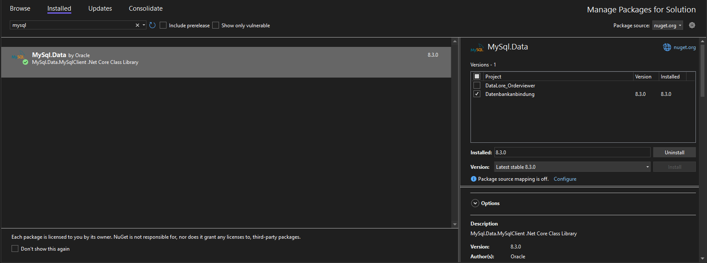

# Installation des MySql.Data-Pakets über den NuGet Package Manager

Die Integration von MySQL-Datenbanken in C#-Anwendungen erfordert das `MySql.Data`-Paket, das einfach über den NuGet Package Manager in Visual Studio installiert werden kann. Der NuGet Package Manager ist ein essentielles Tool in Visual Studio, das die Verwaltung von Paketen in Ihren Projekten vereinfacht. Um das MySql.Data-Paket zu installieren, folgen Sie diesen Schritten:

1. Öffnen des NuGet Package Managers: Starten Sie Visual Studio und öffnen Sie Ihre Lösung (Solution). Navigieren Sie im Hauptmenü zu `Tools` > `NuGet Package Manager` > `Manage NuGet Packages for Solution...`. Dies öffnet den NuGet Package Manager für Ihre Lösung.

2. Suchen des `MySql.Data-Pakets`: Im NuGet Package Manager, wechseln Sie zum Browse-Tab. Geben Sie in das Suchfeld „MySql“ ein. Die Suche liefert verschiedene Pakete, einschließlich `MySql.Data`.

3. Auswahl und Installation: Klicken Sie auf das `MySql.Data`-Paket in den Suchergebnissen. Auf der linken Seite werden die Projekte (Solutions) angezeigt, zu denen Sie das Paket hinzufügen können. Setzen Sie einen Haken bei der Solution, in der Sie das Paket verwenden möchten, und klicken Sie auf Install. Visual Studio wird nun das Paket herunterladen und installieren. Dieser Vorgang kann einige Momente in Anspruch nehmen.

4. Verwendung im Code: Nach der erfolgreichen Installation können Sie das MySql.Data-Paket in Ihrem C#-Projekt verwenden. Dazu müssen Sie nur die entsprechenden using-Direktiven zu Ihren C#-Dateien hinzufügen, um auf die Funktionalitäten des Pakets zugreifen zu können.

Durch die Installation des `MySql.Data`-Pakets über den NuGet Package Manager stellen Sie sicher, dass Ihr Projekt alle notwendigen Abhängigkeiten besitzt, um eine Verbindung zu MySQL-Datenbanken herzustellen und zu verwalten. Dies ist der erste Schritt, um die Kraft von MySQL in Ihren C#-Anwendungen zu nutzen.

Nach der Installation sollte das Paket im Reiter `Installed` angezeigt werden:



Jetzt kann das Paket mittels using-Direktive am Anfang des Codes verwendet werden:

``` cs
using MySql.Data.MySqlClient;
```