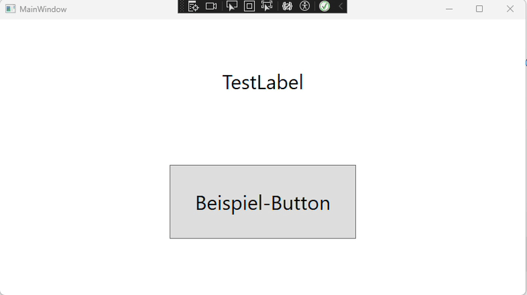

# Button binden

In diesem Abschnitt erklären wir, wie Sie einen Button in Ihrer WPF-Anwendung binden und eine Methode im ViewModel aufrufen können, um den Text eines Labels zu ändern.

## Methode im ViewModel definieren

Zuerst definieren wir eine Methode in der Klasse `MainWindowViewModel`, die den Text des Labels ändert. Fügen Sie den folgenden Code in `MainWindowViewModel.cs` ein:

```csharp
namespace WpfApp1
{
    public class MainWindowViewModel : INotifyPropertyChanged
    {

        // Private Variable für den Label-Inhalt
        private string labelTest = "TestLabel";

        // Öffentliche Eigenschaft für den Label-Inhalt
        public string LabelTest
        {
            get => labelTest;
            set
            {
                labelTest = value;
            }
        }

        // Methode zum Ändern des Textes
        public void ChangeText()
        {
            LabelTest = "Text Changed!!!";
        }

        // Deklarieren des PropertyChanged-Ereignisses
        public event PropertyChangedEventHandler? PropertyChanged;

        // OnPropertyChanged löst das PropertyChanged-Ereignis aus und übergibt
        // die Quelleigenschaft, die aktualisiert wird.
        protected void OnPropertyChanged(string propertyName)
        {
            if (this.PropertyChanged != null)
            {
                PropertyChanged(this, new PropertyChangedEventArgs(propertyName));
            }
        }

    }
}
```

!!! note
    Die Methode `ChangeText` im ViewModel hat einen allgemein gültigen Namen, da das ViewModel nicht weiß, wann der Text geändert wird. Diese Logik wird in der UI festgelegt.

## Button-Click-Event im XAML definieren

Um zu definieren, dass bei einem Button-Click die Methode des ViewModels aufgerufen wird, müssen wir das Click-Event des Buttons festlegen. Durch Doppelklick auf den Button im Designer wird für Sie automatisch eine Funktion angelegt.

??? note

    Alternativ können Sie die Methode selbst definieren und den Tag manuell im xaml hinzufügen:

    ```xml
    <Button Content="Beispiel-Button" ... Click="Button_Click"/>
    ```

## Event-Handler im Code-Behind erstellen

Durch einen Doppelklick auf den Button im Designer wird automatisch eine Funktion im Code-Behind erstellt, die immer aufgerufen wird, wenn der Button geklickt wird. Der Code-Behind gehört direkt zur Oberfläche und enthält Logik, die mit der Benutzeroberfläche interagiert.

Hier ist der Code, der im `MainWindow.xaml.cs` hinzugefügt wird:

```csharp
using System.Windows;

namespace WpfApp1
{
    public partial class MainWindow : Window
    {
        public MainWindow()
        {
            InitializeComponent();
        }

        private void Button_Click(object sender, RoutedEventArgs e)
        {
            MainWindowViewModel viewModel = (MainWindowViewModel)FindResource("mwvm");

            viewModel.ChangeText();
        }
    }
}
```

!!! info
    Dieser Code wird im Code-Behind erstellt, der direkt zur Oberfläche gehört. Er enthält die Logik, die beim Klicken des Buttons ausgeführt wird.

### Erklärung des Codes

- **Click-Event im Button**: Das `Click`-Attribut des `Button`-Elements ist auf `Button_Click` gesetzt. Dies bedeutet, dass die Methode `Button_Click` im Code-Behind aufgerufen wird, wenn der Button geklickt wird.
- **Button_Click-Methode im Code-Behind**: In der `Button_Click`-Methode suchen wir das ViewModel-Objekt mithilfe der `FindResource`-Methode. Dadurch erhalten wir das bereits instanziierte ViewModel, das wir in `App.xaml` [definiert](databinding.md#instanziieren-der-viewmodel-klasse-in-appxaml) haben.
- **ViewModel-Methode aufrufen**: Nachdem wir das ViewModel-Objekt gefunden haben, können wir die Methode `ChangeText` des ViewModels aufrufen, um den Text des Labels zu ändern. Es ist wichtig, dass wir kein neues ViewModel erstellen (also nicht `new MainWindowViewModel`), sondern das bestehende Objekt verwenden.

Durch das Binden des Buttons und das Aufrufen der Methode im ViewModel können wir eine lose Kopplung zwischen der Benutzeroberfläche und der Geschäftslogik erreichen, was die Wartbarkeit und Flexibilität Ihrer Anwendung verbessert.

!!! bug
    Wenn Sie den Code jetzt ausführen, wird der Text noch nicht geändert. Das liegt daran, dass die Oberfläche nicht mitbekommt, dass sich der Inhalt des Labels geändert hat.


## Eigenschaftsänderungen im ViewModel benachrichtigen

Wenn das Programm so ausgeführt wird, wird das Label noch nicht geändert. [Zur Erinnerung](databinding.md#das-propertychanged-ereignis-im-detail): Die UI kann die Methoden des ViewModels verwenden, jedoch kennt das ViewModel die UI nicht. Das stellt sicher, dass die UI austauschbar bleibt.

Wenn sich eine Eigenschaft im ViewModel ändert, müssen wir der UI Bescheid geben. Dafür verwenden wir die `OnPropertyChanged()`-Methode.

Da wir bereits einen Setter haben, der zum Setzen des Inhalts verwendet wird, können wir direkt diesen Setter verwenden und dort die `OnPropertyChanged`-Methode einfügen:

```csharp
// in MainWindowViewModel

    // Öffentliche Eigenschaft für den Label-Inhalt
    public string LabelTest
    {
        get => labelTest;
        set
        {
            labelTest = value;
            OnPropertyChanged(nameof(LabelTest)); // UI über die Änderung benachrichtigen
        }
    }
```

Durch das Hinzufügen des Aufrufs `OnPropertyChanged(nameof(LabelTest))` im Setter der `LabelTest`-Eigenschaft wird die UI automatisch benachrichtigt, wenn sich der Wert der Eigenschaft ändert. Dadurch wird die Bindung aktualisiert und der neue Wert in der UI angezeigt.

??? example
    