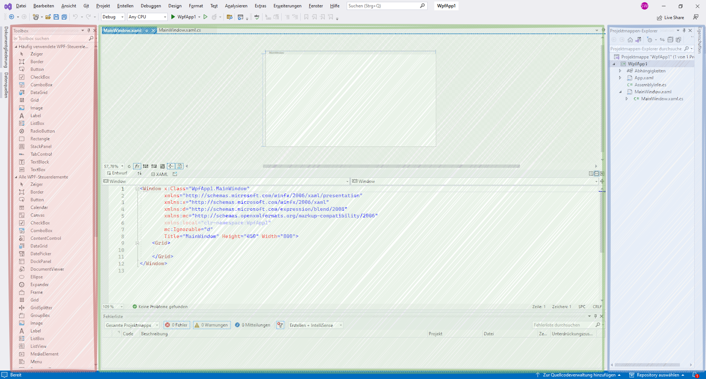

# Grundlagen von WPF

## Aufbau einer WPF-Anwendung

### Projektstruktur

Eine typische WPF-Anwendung besteht aus mehreren Dateien und Ordnern, die zusammenarbeiten, um die Benutzeroberfläche und die Geschäftslogik zu definieren. 

Die wichtigsten Bestandteile einer WPF-Anwendung sind:

- **App.xaml und App.xaml.cs**: Diese Dateien definieren die Anwendungsressourcen und das Startverhalten der Anwendung. `App.xaml` enthält allgemeine Ressourcen wie Stile und Vorlagen, während `App.xaml.cs` den Einstiegspunkt der Anwendung (Main-Methode) und Initialisierungslogik enthält.
  
  ```xml
  <!-- App.xaml -->
  <Application x:Class="WpfApp1.App"
               xmlns="http://schemas.microsoft.com/winfx/2006/xaml/presentation"
               xmlns:x="http://schemas.microsoft.com/winfx/2006/xaml"
               StartupUri="MainWindow.xaml">
      <Application.Resources>
          <!-- Ressourcen wie Stile, Vorlagen, etc. -->
      </Application.Resources>
  </Application>
  ```

  ```csharp
  // App.xaml.cs
  using System.Windows;

  namespace WpfApp1
  {
      public partial class App : Application
      {
      }
  }
  ```

- **MainWindow.xaml und MainWindow.xaml.cs**: Diese Dateien definieren das Hauptfenster der Anwendung. `MainWindow.xaml` beschreibt das Layout und die Benutzeroberfläche, während `MainWindow.xaml.cs` die Interaktionslogik für das Hauptfenster enthält.

  ```xml
  <!-- MainWindow.xaml -->
  <Window x:Class="WpfApp1.MainWindow"
          xmlns="http://schemas.microsoft.com/winfx/2006/xaml/presentation"
          xmlns:x="http://schemas.microsoft.com/winfx/2006/xaml"
          xmlns:d="http://schemas.microsoft.com/expression/blend/2008"
          xmlns:mc="http://schemas.openxmlformats.org/markup-compatibility/2006"
          mc:Ignorable="d"
          Title="MainWindow" Height="450" Width="800">
      <Grid>
          <!-- Benutzeroberflächen-Elemente -->
      </Grid>
  </Window>
  ```

  ```csharp
  // MainWindow.xaml.cs
  using System.Windows;

  namespace WpfApp1
  {
      public partial class MainWindow : Window
      {
          public MainWindow()
          {
              InitializeComponent();
          }
      }
  }
  
  ```

### Hauptkomponenten

Eine WPF-Anwendung besteht aus mehreren Hauptkomponenten, die zusammenarbeiten, um eine reiche Benutzererfahrung zu bieten:

- **Fenster (Window)**: Das grundlegende Container-Element für die Benutzeroberfläche einer WPF-Anwendung. Fenster können mehrere UI-Elemente enthalten und unterstützen Funktionen wie Größenänderung, Minimierung und Maximierung.

- **Steuerelemente (Controls)**: UI-Elemente wie Buttons, TextBoxen, Labels, ListBoxen, etc., die in einem Fenster platziert werden können, um die Interaktion mit dem Benutzer zu ermöglichen. In der Toolbox auf der linken Seite des Visual Studio Fensters sehen Sie eine Auswahl der häufig verwendeten WPF-Steuerelemente.

- **Layouts**: Container-Elemente wie Grid, StackPanel, DockPanel, etc., die verwendet werden, um andere UI-Elemente in einer bestimmten Anordnung zu platzieren. Im `MainWindow.xaml` wird ein `Grid`-Layout verwendet, um die Benutzeroberfläche zu strukturieren.

### Beispielstruktur

Das Bild zeigt die typische Struktur einer WPF-Anwendung in Visual Studio:

<figure markdown="span">
  { width="800" }
  <figcaption>Leeres Beispielprojekt</figcaption>
</figure>

- <span style="color: #B85450">**Toolbox**: </span>Enthält eine Liste der verfügbaren Steuerelemente, die in die Benutzeroberfläche gezogen und dort verwendet werden können. Wird diese nicht angezeigt, kann Sie entweder unter dem Menüpunkt "Ansicht" oder via Tastenkombination `Strg + W, X` eingeblendet werden.
- <span style="color: #82B366">**XAML-Editor und Designer**: </span>Der obere Bereich zeigt den visuellen Designer, in dem Sie die Benutzeroberfläche visuell bearbeiten können. Der untere Bereich zeigt den XAML-Code, in dem Sie die Benutzeroberfläche in XAML definieren können.
- <span style="color: #6C8EBF">**Projektmappen-Explorer**: </span>Zeigt die Dateien und Ordner des Projekts. Hier sehen Sie die `App.xaml`, `MainWindow.xaml`, und deren zugehörige Code-Behind-Dateien.

!!! info
    Die Projektstruktur und die Hauptkomponenten einer WPF-Anwendung sind entscheidend für die Organisation und Verwaltung des Codes. Eine klare Trennung von Layout (XAML) und Logik (C#) fördert die Wartbarkeit und Erweiterbarkeit der Anwendung.